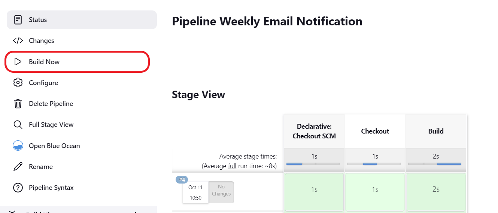

# Weekly Notifications Jenkin Pipeline with Python

This repository contains a python script to send emails to specified addresses and Jenkins Configuration File to build the pipeline.


## Steps to run

Note:- I have tested the pipeline by setting up a local SMTP server. Please follow [PaperCut-SMTP](https://github.com/ChangemakerStudios/Papercut-SMTP) to setup a local SMTP Server.

Step 1: Log into Jenkins and select ‘New item’ from the dashboard.


Step 2: Next,Enter a description (optional) and a name for your pipeline and select ‘pipeline’ project. Click on ‘ok’ to proceed.


Step 3: Scroll down to the pipeline and check 'Build Periodically' under Build Triggers and enter ```H 9 * * 6``` to schedule the pipeline on every Saturday morning.


Step 4: Choose ‘pipeline script from SCAM’ under Pipeline and paste [repository link](https://github.com/mohammedshariqnawaz/EmailNotificationSender.git) under 'Repository URL'. Type ```*/main``` as 'Branch Specifier' and ```JenkinsFile``` as 'Script Path'
 and click 'Save'. Enter your desired arguments in line 16 of [JenkinsFile](https://github.com/mohammedshariqnawaz/EmailNotificationSender/blob/main/JenkinsFile).

Note:- ```-s``` denotes sender address.

```-r``` denotes recipient addresses.

```-m``` denotes message to be sent.

```-c``` denotes configuration(host followed by port number).

Eg:-```python sendEmail.py -s "no-reply-sre@test.com" -r  "John.smith@test.com" "rodger.more@test.com" "papercut@user.com" -m "Service XYZ has planned maintenance on Saturday from 14:00 till 17:00 CET" -c "localhost" 25'```


Step 5: Once the Jenkins Project Dashboard is loaded, click 'Build Now' to build the pipeline.


